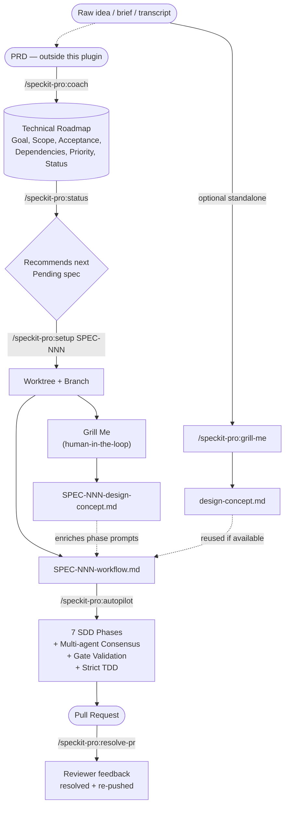
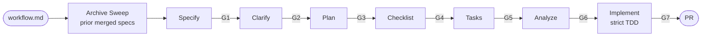

# speckit-pro

> Autonomous Spec-Driven Development for Claude Code and Codex, powered by [GitHub SpecKit](https://github.com/github/spec-kit).

Turn a feature description into a PR with tests, implementation, and a full paper trail of design decisions — without writing the spec, plan, or task list yourself. speckit-pro orchestrates the SDD workflow end-to-end: it interviews you to lock scope, writes the spec, plans the implementation, validates each phase against gates, and implements with strict TDD.

## What you get

- **One command, end-to-end.** `/speckit-pro:autopilot` runs all 7 SDD phases — Specify → Clarify → Plan → Checklist → Tasks → Analyze → Implement — and opens a PR.
- **Multi-agent consensus on ambiguity.** Three perspective agents (codebase, project decisions, industry best practices) resolve gaps with a 2-of-3 vote; security-keyword questions always escalate to you.
- **Programmatic gate validation between phases.** No silent drift — `[NEEDS CLARIFICATION]` markers, `[Gap]` markers, and HIGH/CRITICAL findings have to clear before the next phase runs.
- **Strict TDD on implement.** Red → green → refactor, one task at a time.
- **Human-in-the-loop scoping.** `/speckit-pro:grill-me` walks you down the design tree before any spec is written, asking one question at a time with the AI's recommended answer marked.
- **Cross-platform.** Same workflow on Claude Code and Codex.

## Quick start

### 1. Install

**Claude Code:**

```text
/plugin marketplace add racecraft-lab/racecraft-plugins-public
/plugin install speckit-pro@racecraft-plugins-public
```

**Codex** (open the repository in Codex first):

```text
codex
/plugins
```

After install, run `@SpecKit Pro` → `install` to register custom agents, then restart Codex. See [Installation](#installation) for the full sequence.

### 2. Prerequisites

```bash
uv tool install specify-cli --from git+https://github.com/github/spec-kit.git
specify init --ai claude
```

Then in Claude Code or Codex:

```text
/speckit.constitution    # one-time: define your project's principles
```

### 3. Run your first spec

```text
# Optional — start from a raw idea or transcript and lock scope first
/speckit-pro:grill-me docs/raw-idea.md

# Author or update a multi-spec roadmap
/speckit-pro:coach help me create a technical roadmap

# See what's pending
/speckit-pro:status

# Set up a spec (creates worktree, runs Grill Me, populates workflow)
/speckit-pro:setup SPEC-001

# Run autopilot — handles spec → PR
/speckit-pro:autopilot docs/ai/specs/SPEC-001-workflow.md
```

> **Tip:** Run Claude Code with `claude --permission-mode acceptEdits` so the autopilot doesn't pause on every file edit. Plugin agents inherit the parent session's permission mode (see [Troubleshooting](#troubleshooting)).

## Commands at a glance

| Capability | Claude Code | Codex |
|---|---|---|
| SDD coaching | `/speckit-pro:coach` | `/speckit-coach` or `$speckit-coach` |
| Iterative scoping interview | `/speckit-pro:grill-me` | `$grill-me` or select `Grill Me` from `@SpecKit Pro` |
| Spec setup (worktree + workflow file) | `/speckit-pro:setup` | `/speckit-setup` or `$speckit-setup` |
| Autopilot (7 SDD phases → PR) | `/speckit-pro:autopilot` | `/speckit-autopilot` or `$speckit-autopilot` |
| Project status + next-spec recommendation | `/speckit-pro:status` | `/speckit-status` or `$speckit-status` |
| PR review-comment remediation | `/speckit-pro:resolve-pr` | `/speckit-resolve-pr` or `$speckit-resolve-pr` |
| Codex agent install / repair | _(N/A)_ | `@SpecKit Pro` → `install` or `$install` |

In Codex you can also type `@SpecKit Pro` and pick a skill from the menu. Codex CLI uses `/plugins` (plural) — Claude Code uses `/plugin`.

## How it works

speckit-pro takes raw input through three increasingly structured artifacts on its way to a PR.



The **Design Concept doc** is the source of truth for scoping decisions captured during Grill Me. It informs the workflow file's phase prompts at setup time and is re-read by autopilot's consensus analysts when intra-workflow ambiguity arises. Workflow files generated *without* a corresponding design concept are flagged in `/speckit-pro:status` (the **DC** column).

### Inside the autopilot



Each phase delegates to a specialized agent. Multi-agent consensus runs whenever a phase surfaces a question, gap, or finding it can't resolve directly. The **Archive Sweep** at startup checks the optional [`archive` extension](https://github.com/github/spec-kit), records eligible prior merged specs, excludes the current target, and stays dry-run-only on dirty or unsafe branches.

### Gate validation

Gates run programmatically between phases via `validate-gate.sh`. Each gate gets up to 2 auto-fix attempts before stopping (configurable).

| Gate | Phase | Passes when |
|---|---|---|
| **G1** | Specify | `spec.md` exists, 0 `[NEEDS CLARIFICATION]` markers |
| **G2** | Clarify | 0 `[NEEDS CLARIFICATION]` markers in `spec.md` |
| **G3** | Plan | `plan.md` exists, 0 unresolved markers |
| **G4** | Checklist | 0 `[Gap]` markers in `spec.md` and `plan.md` |
| **G5** | Tasks | `tasks.md` exists with task entries |
| **G6** | Analyze | 0 CRITICAL/HIGH findings remain |
| **G7** | Implement | All tasks marked complete |

### Multi-agent consensus

When a phase hits ambiguity, three perspective agents weigh in:

| Agent | Perspective | Primary tools |
|---|---|---|
| **codebase-analyst** | What does the existing code show? | RepoPrompt, or Grep / Glob / Read |
| **spec-context-analyst** | What do project decisions say? | Read (constitution, roadmap, prior specs) |
| **domain-researcher** | What do best practices recommend? | Tavily / Context7, or WebSearch / WebFetch |

**Default rules (moderate mode):**

- 2 of 3 agree → use majority answer
- 3 of 3 agree → high confidence, apply automatically
- All disagree → flag for human review
- Security keywords (auth, token, secret, PII) → always flag for human

Configure in `.claude/speckit-pro.local.md` (see [Configuration](#configuration)).

## Command reference

<details>
<summary><strong><code>/speckit-pro:coach</code> — SDD methodology coaching</strong></summary>

Get coaching on any aspect of the workflow.

```text
/speckit-pro:coach walk me through SDD
/speckit-pro:coach help me create a technical roadmap
/speckit-pro:coach which checklist domains for a REST API
/speckit-pro:coach the simplicity gate is failing
/speckit-pro:coach how does the consensus protocol work
```

**Covers:** getting started, per-command coaching, constitution design, checklist domain selection, technical roadmap creation, gate failure troubleshooting, autopilot usage, and consensus protocol.

</details>

<details>
<summary><strong><code>/speckit-pro:grill-me [input]</code> — iterative scoping interview</strong></summary>

Walks down each branch of the design tree, asks one question at a time, and provides the AI's recommended answer for every question. Strictly human-in-the-loop — never invoked from autopilot.

```text
/speckit-pro:grill-me docs/raw-idea.md
/speckit-pro:grill-me notes/stakeholder-meeting-transcript.txt
/speckit-pro:grill-me "gamification overhaul for the user dashboard"
/speckit-pro:grill-me                        # asks for input first
```

**What it does:**

1. Reads input (file, topic string, or asks for context)
2. Identifies design-tree branches relevant to the input
3. Loops on `AskUserQuestion`, one question at a time, with the AI's recommendation marked `(Recommended)` and 1–2 alternatives
4. Stops at a natural endpoint, on user request, or at the soft cap (30 questions)
5. Synthesizes a Design Concept doc at `docs/ai/specs/<slug>-design-concept.md` with Goals, Non-goals, full Q&A log, and Open Questions

**Use it for:** raw client briefs, meeting transcripts, vague feature ideas — anything where you want shared understanding before committing to a spec. Output feeds directly into `/speckit-pro:coach` (for roadmap authoring) or `/speckit-pro:setup` (for spec execution).

> **Hard constraint:** Grill Me is human-in-the-loop only. Never invoked from `/speckit-pro:autopilot` or any phase agent. Autopilot's Clarify phase uses `/speckit.clarify` with the consensus protocol — those are deliberately different systems.

</details>

<details>
<summary><strong><code>/speckit-pro:setup &lt;SPEC-ID&gt;</code> — prepare a spec for autopilot</strong></summary>

```text
/speckit-pro:setup SPEC-009
```

**What it does:**

1. Finds the technical roadmap and extracts scope, dependencies, and priority for the spec
2. Creates a git worktree and pushes the branch to origin
3. Runs a Grill Me interview using the spec scope as input (always runs; no skip flag)
4. Copies the workflow template and populates all phase prompts using both the roadmap scope and the Design Concept doc
5. Commits both the design concept doc and the workflow file, pushes — ready for autopilot

**Sample output:**

```text
## Setup Complete

Spec:           SPEC-009 Search & Database
Branch:         009-search-database
Worktree:       .worktrees/009-search-database/
Design Concept: .worktrees/009-search-database/docs/ai/specs/SPEC-009-design-concept.md
Workflow:       .worktrees/009-search-database/docs/ai/specs/SPEC-009-workflow.md
Remote:         Pushed to origin/009-search-database

Ready to run:
/speckit-pro:autopilot docs/ai/specs/SPEC-009-workflow.md
```

</details>

<details>
<summary><strong><code>/speckit-pro:autopilot &lt;workflow.md&gt;</code> — execute all 7 SDD phases</strong></summary>

```text
/speckit-pro:autopilot docs/ai/specs/SPEC-009-workflow.md
```

**What it does:**

1. Runs Archive Sweep for previously merged specs (excludes the current target)
2. Validates prerequisites (SpecKit CLI, constitution, workflow file, MCP servers)
3. Executes all 7 SDD phases sequentially, each delegated to a specialized agent
4. Validates gates programmatically between phases (max 2 auto-fix attempts)
5. Runs multi-agent consensus for ambiguous questions, gaps, and findings
6. Implements with strict TDD red-green-refactor
7. Creates a PR via `gh` CLI when complete

</details>

<details>
<summary><strong><code>/speckit-pro:status [SPEC-ID]</code> — roadmap, phase detail, next-spec recommendation</strong></summary>

```text
/speckit-pro:status              # full roadmap + active specs
/speckit-pro:status all          # same as above
/speckit-pro:status SPEC-009     # specific spec detail
```

**What it does:**

1. Finds all workflow files and the technical roadmap
2. Parses phase completion from workflow files
3. Reads archive extension state when present
4. Builds a unified dashboard: completed, in-progress, pending
5. Shows Archive Sweep installation, cleanup safety, excluded current-spec state
6. Recommends the next spec based on priority and dependencies

**Sample output:**

```text
# SpecKit Project Status

## Summary
- Total specs: 14
- Complete: 3
- In progress: 1
- Remaining: 10

## Recommended Next
SPEC-009: Search & Database (10 tools, P1, Tier 2)
/speckit-pro:setup SPEC-009
```

</details>

<details>
<summary><strong><code>/speckit-pro:resolve-pr &lt;PR&gt;</code> — address review comments end-to-end</strong></summary>

```text
/speckit-pro:resolve-pr 42
```

**What it does:**

1. Fetches all unresolved review threads via `gh api`
2. Reads each comment and the code it references
3. Applies fixes, commits in one pass
4. Replies to each thread and resolves it
5. Pushes to the PR branch

</details>

## Configuration

Create `.claude/speckit-pro.local.md` for per-project settings:

```yaml
---
consensus-mode: moderate    # conservative | moderate | aggressive
gate-failure: stop          # stop | skip-and-log
auto-commit: per-phase      # per-phase | batch | none
---
```

| Setting | Options | Default | Description |
|---|---|---|---|
| `consensus-mode` | conservative, moderate, aggressive | moderate | How many agents must agree to auto-apply |
| `gate-failure` | stop, skip-and-log | stop | What happens when a gate fails after 2 auto-fix attempts |
| `auto-commit` | per-phase, batch, none | per-phase | When to commit artifacts during the workflow |

## Best practices

**Use it for:**

- Features that need clear requirements before implementation
- Multi-spec projects with dependency ordering
- Autonomous overnight implementation runs
- Projects where design decisions need a paper trail
- Teams standardizing their specification workflow

**Skip it for:**

- Quick bug fixes or one-line changes
- Exploratory prototyping where requirements are unknown
- Changes that don't warrant a full specification cycle
- Projects without a constitution (create one first with `/speckit.constitution`)

**Tips:**

- **Write a constitution first.** Every spec is validated against it.
- **Review workflow prompts before autopilot.** More context in the prompts → better output.
- **Start with coaching.** Use `/speckit-pro:coach` (Claude Code) or `/speckit-coach` (Codex) before running the autopilot.
- **Use technical roadmaps for multi-spec projects.** Decompose large features into sequential specs with a dependency graph.
- **Trust the gates.** If a gate fails, the spec has a real gap — fix it rather than skipping.
- **Run in `acceptEdits` mode.** Plugin agents inherit the parent session's permission mode.

## Prerequisites

- **Claude Code or Codex** — separate entrypoint surfaces ship for both runtimes
- **SpecKit CLI** — `uv tool install specify-cli --from git+https://github.com/github/spec-kit.git`
- **SpecKit initialized** — `specify init --ai claude`
- **Constitution created** — `/speckit.constitution`
- **GitHub CLI (`gh`)** — required for PR creation and review resolution
- **jq** — required by validation scripts

### Optional MCP servers

These improve research quality but aren't required — every agent has built-in fallbacks.

| MCP server | Enhances | Fallback |
|---|---|---|
| Tavily | Web research for consensus agents | WebSearch + WebFetch |
| Context7 | Library documentation lookup | WebSearch for "[library] docs" |
| RepoPrompt | Codebase exploration and analysis | Grep + Glob + Read |

## Installation

### Claude Code

```text
/plugin marketplace add racecraft-lab/racecraft-plugins-public
/plugin install speckit-pro@racecraft-plugins-public
```

### Codex (repo-scoped)

Open the repository in Codex:

```text
codex
/plugins
```

Codex reads the repo marketplace from [`.agents/plugins/marketplace.json`](../.agents/plugins/marketplace.json).

After install:

1. Run `@SpecKit Pro` → `install` (or `$install`) to copy bundled `codex-agents/*.toml` into `.codex/agents/` or `~/.codex/agents/`
2. Restart Codex so the custom agents are registered

### Codex (user-scope)

For user-scope installs, follow the official Codex local-plugin layout:

1. Copy `speckit-pro/` to `~/.codex/plugins/speckit-pro`
2. Point `~/.agents/plugins/marketplace.json` at `./.codex/plugins/speckit-pro`
3. Restart Codex so the plugin appears
4. Run `@SpecKit Pro` → `install` or `$install`
5. Restart Codex again so the installed custom agents are loaded

When updating the plugin: refresh the plugin directory the marketplace points to, rerun the install skill if any `codex-agents/*.toml` templates changed, and restart Codex so the install cache and custom-agent registry refresh.

**Codex references:**

- [Codex plugins](https://developers.openai.com/codex/plugins)
- [Install a local plugin manually](https://developers.openai.com/codex/plugins/build#install-a-local-plugin-manually)
- [Marketplace metadata](https://developers.openai.com/codex/plugins/build#marketplace-metadata)
- [Codex skills](https://developers.openai.com/codex/skills)
- [Codex subagents](https://developers.openai.com/codex/subagents)

## Troubleshooting

<details>
<summary><strong>Autopilot stops after the first phase</strong></summary>

The autopilot must delegate each phase to a subagent rather than invoking the phase skill directly in the parent session. In Codex that means `spawn_agent` / `wait_agent`; in Claude Code that means the Agent tool. If a phase runs as a Skill in the parent, the command's completion report kills the agent loop.

This is handled automatically — if you see this, re-run the autopilot.

</details>

<details>
<summary><strong>Progress plan disappears mid-run (Codex)</strong></summary>

The autopilot must recreate the full checklist with `update_plan` before Phase 1, keep exactly one item `in_progress`, and mirror the same ordered plan into `autopilot-state.json` next to the workflow file after every transition. If either store is missing, stop and rebuild both before continuing.

</details>

<details>
<summary><strong>Permission prompts on every edit</strong></summary>

Plugin agents cannot set their own `permissionMode` — Claude Code silently ignores it for security. They inherit the parent session's mode.

```text
claude --permission-mode acceptEdits
```

</details>

<details>
<summary><strong>MCP tools not available to agents</strong></summary>

Plugin agents cannot declare their own MCP connections — they depend on the parent session having those servers configured. Check with `/mcp`. All agents include fallback tool chains, so functionality is preserved without MCP — just with reduced research quality.

</details>

<details>
<summary><strong>Gate fails after 2 auto-fix attempts</strong></summary>

A gate that won't pass means a genuine gap in the specification. Read the gate failure output — it tells you exactly which markers remain and where. Fix the underlying issue in the spec/plan artifact, then re-run the phase.

</details>

<details>
<summary><strong>SpecKit CLI not found</strong></summary>

```text
uv tool install specify-cli --from git+https://github.com/github/spec-kit.git
```

</details>

<details>
<summary><strong>Consensus agents disagree on everything</strong></summary>

This usually means the question is genuinely ambiguous. The agents are working correctly — they have different perspectives by design. Review the flagged items, make a decision, and consider adding it to your constitution so future specs don't hit the same ambiguity.

</details>

<details>
<summary><strong>Workflow file has unfilled placeholders</strong></summary>

The autopilot fails when workflow prompts still contain `<!-- ... -->` placeholders. Run `/speckit-pro:setup <SPEC-ID>` (or `/speckit-setup <SPEC-ID>` in Codex) to auto-populate from the technical roadmap. If you're authoring the workflow manually, fill in all phase prompts before running autopilot.

</details>

## Architecture (advanced)

<details>
<summary><strong>Orchestrator-direct pattern</strong></summary>

The autopilot skill runs in the main session so it can spawn subagents directly — no nesting needed.

- **Codex runtime contract** — orchestration is bound to `spawn_agent` / `wait_agent`; progress is required in `update_plan`; the same ordered plan is mirrored into `autopilot-state.json` next to the workflow file for resume safety.
- **Claude Code runtime contract** — orchestration uses the existing Agent tool / task primitives.
- **Archive Sweep startup** — before Phase 0, autopilot checks archive extension state, records eligible prior merged specs, excludes the current target, and stays dry-run-only unless cleanup is explicitly safe.
- **Skill-local Codex metadata** — each Codex skill owns `agents/openai.yaml` for display metadata, invocation policy, and tool dependencies.
- **Bundled Codex custom-agent templates** — `codex-agents/*.toml` ship in the plugin bundle, but Codex still needs them copied into `.codex/agents/` or `~/.codex/agents/` before they're spawnable. Use the `install` skill.
- **Preferred Codex agents** — autopilot uses `phase-executor`, `clarify-executor`, `checklist-executor`, `analyze-executor`, `implement-executor`, `codebase-analyst`, `spec-context-analyst`, and `domain-researcher` by name when registered.
- **Fallback roles** — built-in `worker`, `explorer`, and `default` remain available as a degraded fallback when a matching custom agent is unavailable.
- **Optional fast helper** — `autopilot-fast-helper` (`gpt-5.3-codex-spark`, low reasoning, read-only) for near-instant text-only compression, triage, or query drafting. Advisory only; only the top-level autopilot may call it when available.

</details>

<details>
<summary><strong>Agent dispatch matrix</strong></summary>

| Phase / role | Preferred custom agent | Fallback |
|---|---|---|
| Simple phases (specify, plan, tasks) | `phase-executor` | `worker` |
| Clarify | `clarify-executor` | `worker` |
| Checklist | `checklist-executor` | `worker` |
| Analyze | `analyze-executor` | `worker` |
| Codebase consensus | `codebase-analyst` | `explorer` |
| Project-context consensus | `spec-context-analyst` | `explorer` |
| Domain consensus | `domain-researcher` | `explorer` |
| Implementation (per task, strict TDD) | `implement-executor` | `worker` |

</details>

<details>
<summary><strong>Codex skill packaging</strong></summary>

The Codex skills own their local [`agents/openai.yaml`](./codex-skills/speckit-autopilot/agents/openai.yaml) metadata sidecars — the official Codex skills packaging model. Those sidecars are metadata only; they don't register custom agents.

Real custom-agent registration still happens in `.codex/agents/` or `~/.codex/agents/` per the official [Codex subagents](https://developers.openai.com/codex/subagents) docs. SpecKit Pro keeps a Codex-only `install` skill that copies the bundled `codex-agents/*.toml` templates into those runtime paths.

The built-in `worker`, `explorer`, and `default` roles remain as a degraded fallback. The preferred path is to run the install skill after plugin install and restart Codex.

</details>

## Author

Fredrick Gabelmann — [Racecraft Lab](https://github.com/racecraft-lab)

## License

[MIT](../LICENSE)
